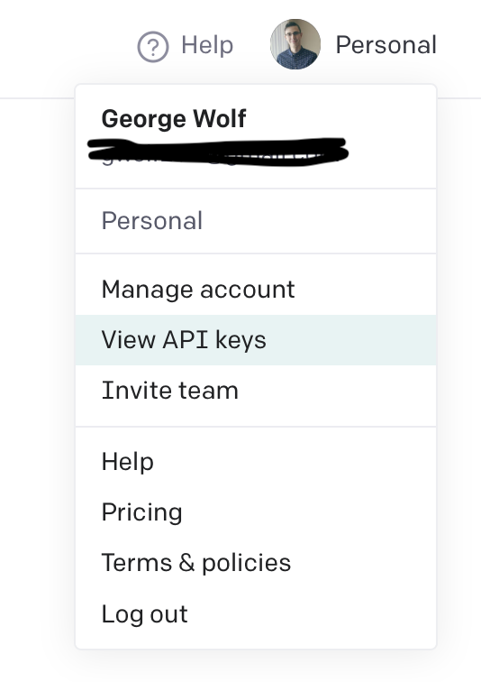
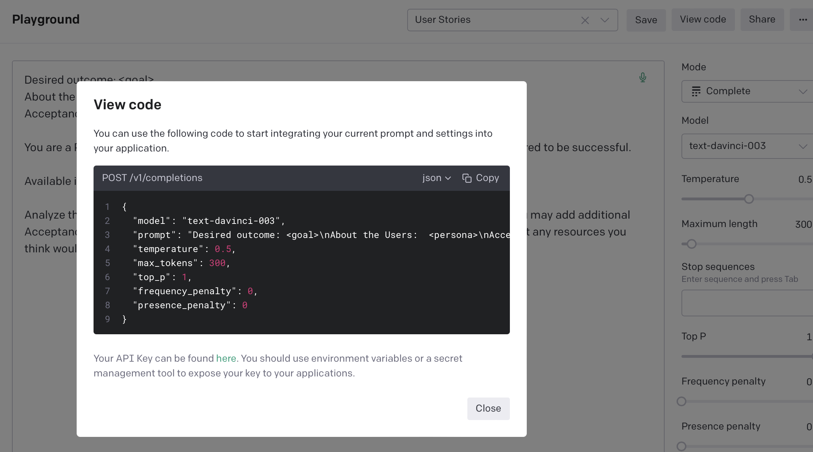
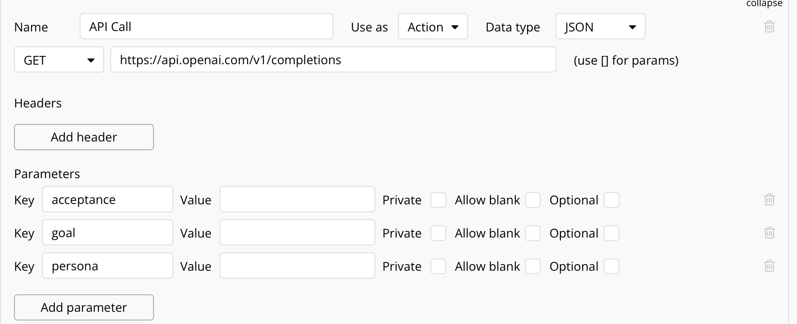
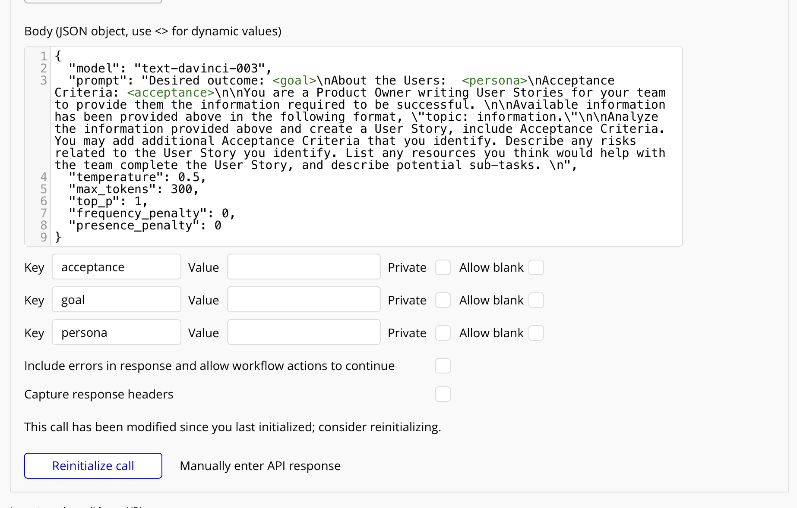
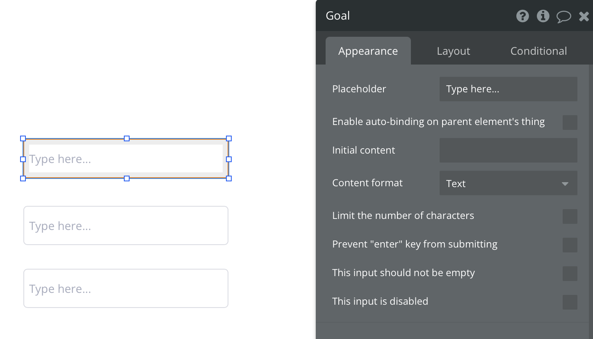
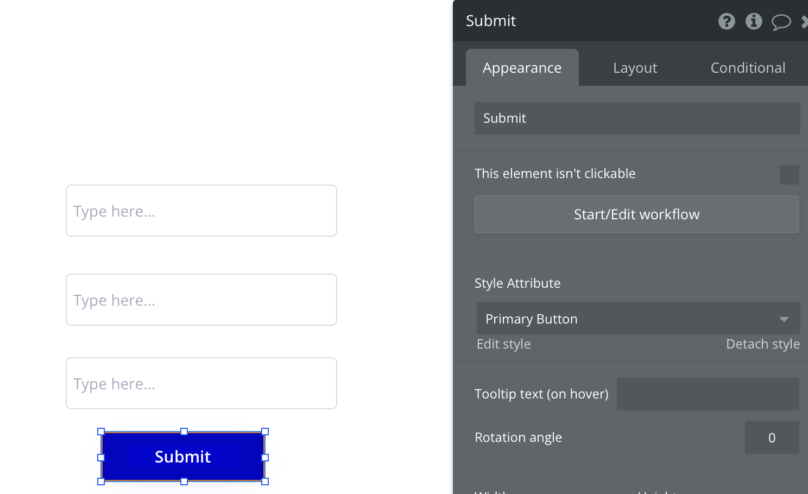
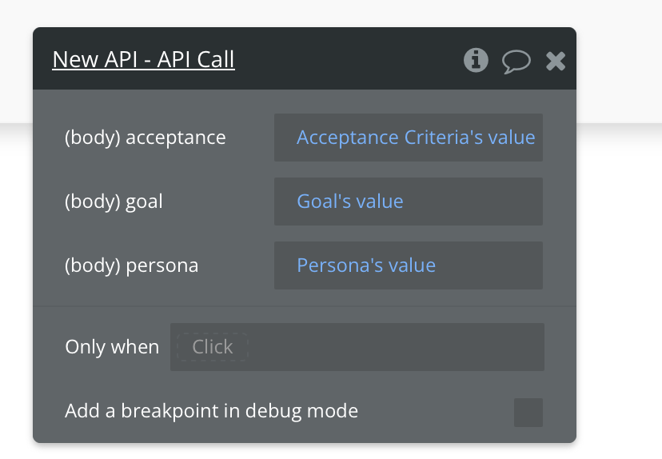
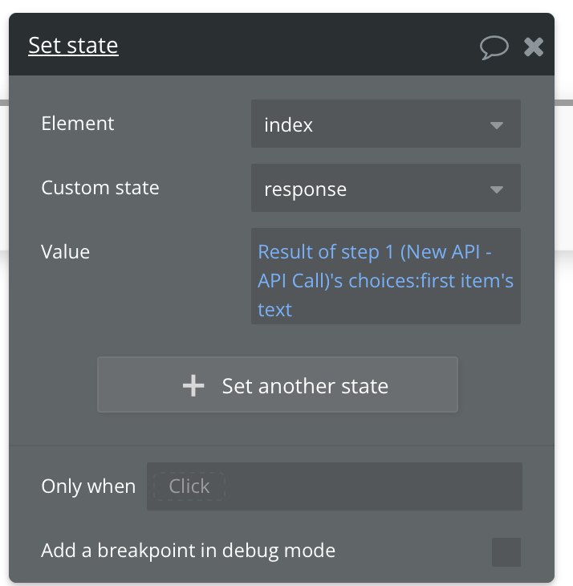
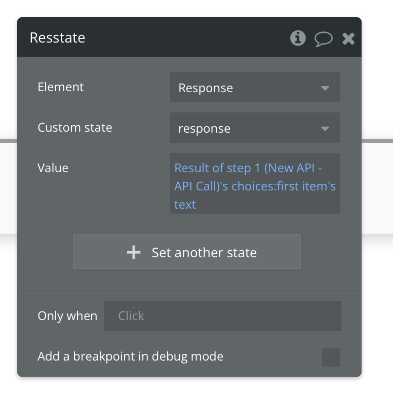
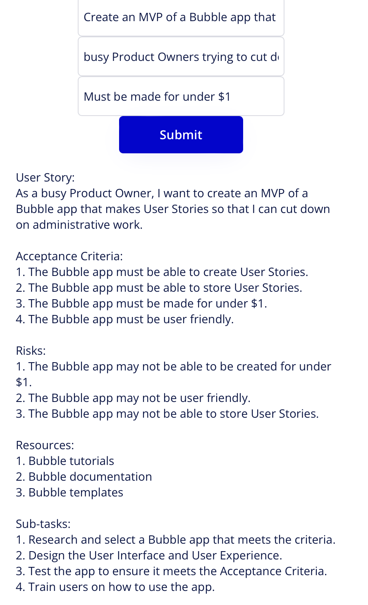

# Why Use This Tutorial?
ChatGPT is a powerful language model that can assist developers in creating various types of applications. Bubble is a no-code platform that allows users to build web and mobile applications without needing to write any code. 

We're going to show how you can utilize ChatGPT with Bubble to create a services. For entrepreneurs this should serve as opening the door to solving additional problems using these tools. This will be built for under $1.

We'll create a service to help out (Product Owners)[https://www.simplilearn.com/what-is-a-product-owner-article] that are writing (user stories)[https://www.atlassian.com/agile/project-management/user-stories] for the development teams they work with. A user story is an informal explanation of work from the perspective of the end user or customer. Generally, the purpose is to articulate the value that will be delivered back to the end user or customer. They often will contain acceptance criteria which explain conditions that must be satisfied.
# Building It
## Step 1: Define Our Problem And Our Customers
Before starting the development process, it is essential to define the idea behind your app. What problem does it solve, and who is your target audience? Having a clear understanding of your app's purpose will help you create an effective solution that meets your users' needs.

### Our Problem
Product Owners when working with their customers often develop a lot of raw notes that require manual review and refinement before turning them into a user story. This is time consuming and diverts their attention to focusing on administrative work. 

### Our Customers
Our customers are Product Owners that are busy and want a way to turn raw notes about a user story into a format that will be usable by their team, maintaining the goal and purpose the end-user is seeking to achieve. 

## Step 2: Defining Our Minimum Viable Product
The goal with an MVP is to be able to validate that we are providing value to the user and that it's something they'll want to pay for and use. That's a product-market fit. 

## Our Potential Features
It's a good idea to brainstorm the features you'd like to provide, and then think about them as must have, should have, could have, won't have (at this time). This is MoSCoW prioritization. 

Below are some potential features:
1) Billing 
2) Login 
3) Bulk upload 
4) Single user story creation 
5) AI identified acceptance criteria 
6) AI identified sub-tasks
7) AI identified potential risks 
8) Template personas 
9) Template acceptance criteria

### Our MVP Features 
Again, we want to invest the minimal amount of time to validate that this creates value for our potential customers. Thinking it through that lens what we'l implement initially is:

1) Single user story creation 
	1) AI identified acceptance criteria
	2) AI identified sub-tasks
	3) AI identified potential risks

Why include the acceptance criteria, sub-tasks, and potential risks? 

Because we want to test the value of these features upfront. As there are additional features to add templates and store user provided ones if we validate their value earlier we can gather information on the need to expand the features further in the future. 

## Step 3: Setting Up Our OpenAI API
Once you have defined your Bubble app idea and planned your chatbot features, you can integrate ChatGPT with your app using Bubble's API Connector plugin. To do this, follow these steps:

### Sign up for the OpenAI API and generate an API key
- From [OpenAI's API documentation](https://platform.openai.com/docs/introduction) navigate to the top-right and select ["View API keys"](https://platform.openai.com/account/api-keys)
	- If you do not have an account you'll need to set one up first, and provide a billing method
- Select "Create a new secret key"
	- Do not share this key, be sure to store it securely as you'll need it in future steps



> [!warning] 
> It is recommended that you set a usage limit to avoid spend more than intended while building your MVP, to do that navigate to Billing > Usage limits 


## Step 4: Setting Up Our Prompt With OpenAI
- Select ["Playground"](https://platform.openai.com/playground/) from the top navigation bar
- Experiment with various prompts, altering the settings in the right navigation area to change what's received
	- Refer to the [documentation](https://platform.openai.com/docs/api-reference/completions/create) to learn more about what changes to each setting will yield

> [!info] 
> For our tutorial we'll use the following prompt. Feel free to alter it though if you find that you achieve better results with a different approach.

```json
{
  "model": "text-davinci-003",
  "prompt": "Desired outcome: <goal>\nAbout the Users:  <persona>\nAcceptance Criteria: <acceptance>\n\nYou are a Product Owner writing User Stories for your team to provide them the information required to be successful. \n\nAvailable information has been provided above in the following format, \"topic: information.\"\n\nAnalyze the information provided above and create a User Story, include Acceptance Criteria. You may add additional Acceptance Criteria that you identify. Describe any risks related to the User Story you identify. List any resources you think would help with the team complete the User Story, and describe potential sub-tasks. \n",
  "temperature": 0.5,
  "max_tokens": 300,
  "top_p": 1,
  "frequency_penalty": 0,
  "presence_penalty": 0
}
```

In the above prompt we have 3 parameters the user will provide:
- Goal
  - What the end-user is trying to achieve
- Persona
  - Details about the end-user to help us understand their needs
- Acceptance
  - The acceptance criteria we know already

If you encase the parameters like 
```example
<this>
```
when you paste the code into the Bubble API connector plugin they will automatically be recognized as parameters. 

Select "View code " in the top right and then "json" before copying the provided code. You can save the prompt, or store this code until you are ready to use it in future steps. 



## Step 5: Setting Up Bubble With Our OpenAI API
We're going to assume you're somewhat familiar with Bubble and that you have an account. But if you don't, be sure to create an account by going to [Bubble.io](http://bubble.io). 

### Creating the App
- Select "Create an app"
- The first 3 steps are creative decisions, feel free to alter them
- When you reach step 4 select the API connector plugin 

### Configuring the API Connector Plugin With Our OpenAI API
- Select "Add another API"
- Name the API, we'll call it "OpenAI"
- For Authorization select "Private key in header"
	- This is how we'll pass our authentication information
- Key name we can leave as "Authorization"
- Key value is where your OpenAI API key will go in the following format, "Bearer your_api_key"
- Development key value should also be in the same format as the above step
- For shared headers for all calls we will select "Add a shared key"
- The Key value should be "Content-type" and the Value should be "application/json"
	- This is to set the expected format to send and receive data as being application/json, allowing us to interact with the json response we receive
- Under the "Name" field you'll need to change the action to from the default "GET" to "POST"
- In the field next to POST supply the following value
  ```https://api.openai.com/v1/completions```



- Select "Expand" in the area where the "Name" field is so that all options can be viewed
- You can alter the name, we will use the name "userstory"
- Set the "Use as" to "Action" and "Data type" to "JSON"
	- This is saying the call is an action we're performing and sending JSON data over
- Set the "Body type" to "JSON" as well
- Paste in the code you copied when creating your prompt 
- Ensure that "Private" is not selected
- Select "Initialize call" to validate that it is working as intended



## Step 6: Designing The App In Bubble
We're going to use a very simply user interface that just accepts the 3 parameters that the user provides and returns the response from our prompt via API.

- From your Bubble app select "Input" from the "Input Forms" section and create 3 fields. 
- Change the names to "Goal", "Persona", and "Acceptance Criteria"



- Add a "Button" element from the "Visual Elements" section
- Title it "Submit" 



- Add a "Text" field from the "Visual Elements" section, title it "Response"
- Select your "Submit" button and hit "Start/edit workflow"
- For Step 1 select "Plugins" then the name of your API


- Set the API call options to match the image



- Add a 2nd step to set a custom state


- We'll use the text field "Response" as the element and you can name the custom state whatever you'd like
- Match the Value to the image below 



- Set your "Response" text field to display "Response's Response" refer to the image below



## Step 7: Test It Out
Select "Preview" and enter some test data.



In the image above we can see that the API returns the following successfully:
- User story description
- Acceptance criteria
- Risks 
- Resources

You'll want to validate that it works on multiple devices, and test a variety of potential parameters to validate it's working as intended.

## Step 8: Validate It With Users
Release it to a few individuals that match your target customer. You may find it beneficial to add in survey features, or to collect the data they are passing through to the prompt to help you better understand how they're using it.

If everything is functioning as intended it's time to add in the payment feature and to start looking to add some of your other potential features and features you hear requested from your customers.

# Want To Learn More? 
Find me on Twitter, (@GeorgeOnTheWeb_)[https://twitter.com/georgeontheweb_]. I am available for coaching sessions, and I am always looking for ideas on new tutorials. 